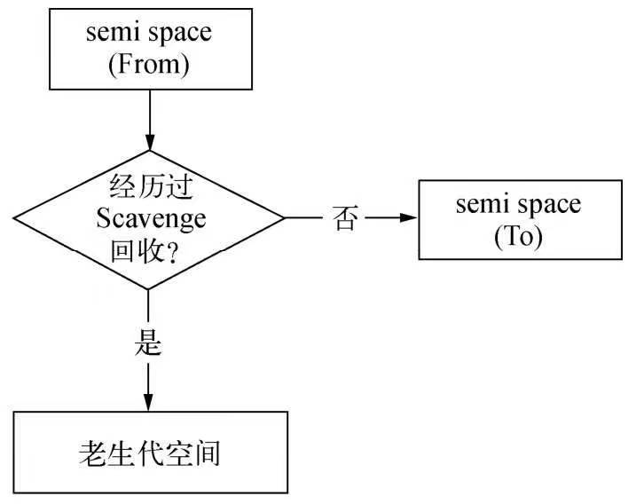

## 服务器程序性能
Node极大的拓宽了JavaScript的使用场景，当主流使用场景从客户端延伸到服务器端，我们就能发现，对于性能敏感的服务器程序，内存管理的好坏、垃圾回收机制是否优良，都会对服务构成影响。

## V8的内存限制
在一般的后端开发语言中，在基本的内存使用上没有什么限制
然而在Node中通过JavaScript使用内存就会发现只能使用部分内存（64位操作系统下约为1.4GB,32位操作系统下约为0.7GB）
### V8的对象分配
要知晓V8为何会限制内存的使用量，则需要回归到V8在内存使用上的策略

在V8中，所有的JavaScript对象都是通过堆来进行分配的。V8限制内存的深层原因为V8的垃圾回收机制的限制。按官方的说法，以1.5GB的垃圾回收堆内存为例，V8做一次小的垃圾回收需要50ms以上，做一次非增量式的垃圾回收甚至要1秒以上。这是垃圾回收中引起JavaScript线程暂停执行的时间，在这样的时间花销下，应用的性能和响应能力都会直线下降。

### 改变内存限制
Node在启动时可以传递--max-old-space-size或--max-new-space-size来调整内存限制的大小
```js
node  --max-old-space-size=1700 test.js // 单位为MB
node  --max-new-space-size=1700 test.js// 单位为KB
```
## V8的垃圾回收机制
### V8主要的垃圾回收算法
V8的垃圾回收策略主要基于分代式垃圾回收机制。

在自动垃圾回收的演变过程中，人们发现没有一种垃圾回收算法能够胜任所有的场景。因为在实际的应用中，对象的生存周期长短不一，不同的算法只能针对特定情况具有最好的效果。为此，统计学在垃圾回收算法的发展过程中产生了较大的作用，现代的垃圾回收算法中按对象的存活时间将内存的垃圾回收进行不同的分代，然后分别对不同分代的内存施以更高效的算法。

在V8中，主要将内存分为新生代和老生代两代。V8堆的整体大小就是新生代和老生代使用的内存空间。前面提到的--max-old-space-size命令行参数可以用于设置老生代内存空间的最大值，--max-new-space-size可以用于设置新生代内存空间的大小。
```
|---------------------|----------------------|
|     新生代的         |       老生代的       |
|     内存空间         |       内存空间       |
|---------------------|----------------------|

                 V8的分代示意图
```
### Scavenge算法
在分代的基础上，新生代中的对象主要通过Scavenge算法进行垃圾回收。在Scavenge的具体实现中，主要采用了Cheney算法：

Cheney算法是一种采用复制的方法实现的垃圾回收算法，它将堆内存一分为二，每一部分空间称为semispace。在这两个semispace空间中,只有一个处于使用中，另一个处于闲置状态，处于使用状态的空间称为Form空间，处于闲置状态的空间称为To空间，当我们分配对象时，先是在From空间中进行分配，当开始进行垃圾回收时，会检查From空间中的存活对象，这些存活对象将被复制到To空间中,而非存活对象占用的空间将被释放。复制完成后，From空间和To空间的角色发生对换。
简而言之，在垃圾回收的过程中，就是通过将存活对象在两个semiscape空间之间进行复制。
Scanvenge的缺点是只能使用堆内存中的一半
